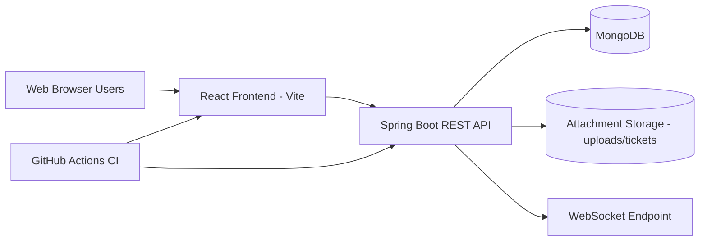
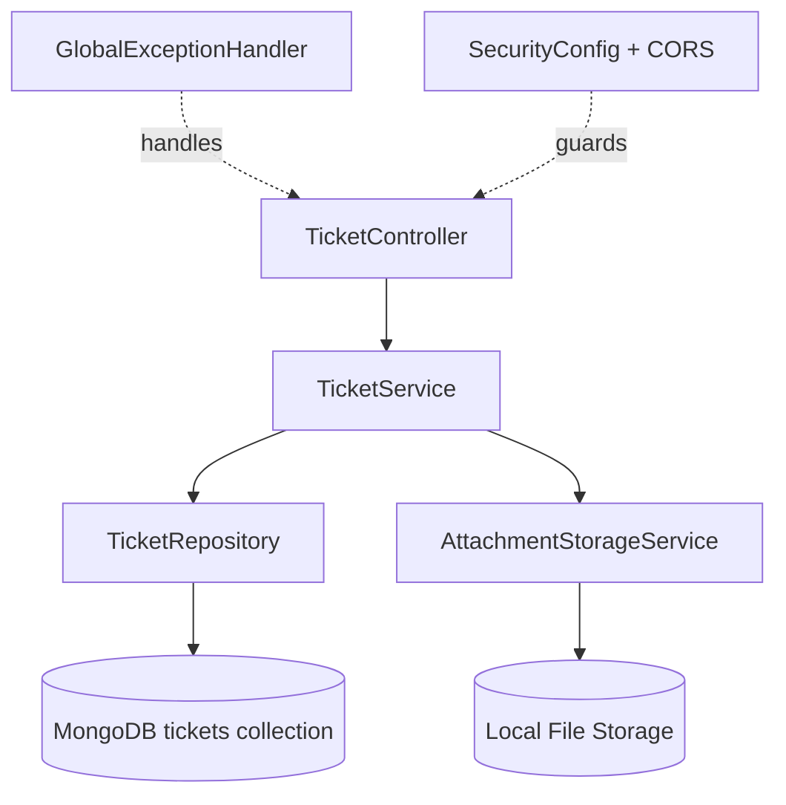

# Smart Campus Operations Hub - IT3030 PAF Assignment 2026

A comprehensive web platform for managing university facility bookings, asset management, and maintenance operations.

## 📋 Project Overview

This system provides:
- **Module A**: Facilities & Assets Catalogue Management
- **Module B**: Booking Management with Workflow
- **Module C**: Maintenance & Incident Ticketing
- **Module D**: Real-time Notifications
- **Module E**: OAuth 2.0 Authentication & Role-Based Authorization

## 🏗️ Tech Stack

### Backend
- Java 17
- Spring Boot 4.0.5
- Spring Security
- Spring Data MongoDB
- MongoDB Database
- Maven

### Frontend
- React 18+
- React Router
- Fetch API service layer
- Custom CSS + Vite

### DevOps
- GitHub Actions (CI/CD)
- JUnit & Mockito (Backend Testing)
- Jest & React Testing Library (Frontend Testing)

## Module C Requirements Coverage (Implemented)

### Functional Requirements

Backend API:
- Create incident ticket with category, description, priority, location/resource and preferred contact details.
- Upload image attachments to tickets with safe file validation and storage.
- Ticket status workflow enforcement: OPEN -> IN_PROGRESS -> RESOLVED -> CLOSED, with ADMIN-only REJECTED.
- Assign technician/staff member to a ticket.
- Add resolution notes and rejection reason validation where required.
- Add, edit, delete comments with ownership enforcement (owner or ADMIN).
- Filter/search ticket list by status, priority, category, assignee, reporter, resource and keyword.
- Ticket statistics endpoint for dashboard counters.

Frontend client:
- New ticket form with required validation and up to 3 image uploads.
- Ticket listing with searching, filters, and summary cards.
- Ticket details view with workflow actions, timeline, attachments, and comments.
- Role-aware action behavior using user context headers.

### Non-Functional Requirements

- Security: input validation, role-aware authorization checks, safe file handling, request header-based actor identity, consistent error responses.
- Performance: indexed MongoDB-friendly query patterns and lightweight summary endpoint for counts.
- Scalability: layered architecture (controller/service/repository), decoupled attachment storage service, CI pipeline for continuous quality checks.
- Usability: clear ticket workflow states, actionable detail page, form validation messages, and intuitive ticket list filtering.

## Architecture Diagrams

### Overall System Architecture



### REST API Architecture (Layered)



### Frontend Ticket Architecture

```mermaid
flowchart TD
  P1[NewTicketPage] --> TS[ticketService]
  P2[TicketListPage] --> TS
  P3[TicketDetailsPage] --> TS
  TS --> API[/api/tickets]
  API --> DB[(MongoDB)]
```

## Module C API Endpoints

Implemented under `/api/tickets`:
- `POST /api/tickets` - Create ticket.
- `POST /api/tickets/with-attachments` - Create ticket with up to 3 image files.
- `GET /api/tickets` - List/filter tickets.
- `GET /api/tickets/my` - List current user tickets.
- `GET /api/tickets/{id}` - Get ticket details.
- `PUT /api/tickets/{id}` - Update ticket details.
- `PATCH /api/tickets/{id}/status` - Update status with workflow validation.
- `PATCH /api/tickets/{id}/assign` - Assign technician.
- `DELETE /api/tickets/{id}` - Delete ticket (owner or ADMIN).
- `POST /api/tickets/{id}/attachments` - Add attachment.
- `GET /api/tickets/{id}/attachments/{attachmentId}/download` - Download attachment.
- `DELETE /api/tickets/{id}/attachments/{attachmentId}` - Remove attachment.
- `POST /api/tickets/{id}/comments` - Add comment.
- `PUT /api/tickets/{id}/comments/{commentId}` - Edit comment.
- `DELETE /api/tickets/{id}/comments/{commentId}` - Delete comment.
- `GET /api/tickets/stats` - Get ticket stats.

## Validation and Error Handling

- Bean validation on DTOs (`@NotBlank`, `@NotNull`, `@Size`, `@Email`, `@Pattern`).
- Centralized error handling with meaningful status codes and structured response body.
- Business-rule validation for invalid ticket state transitions.
- Attachment constraints: image-only mime types, max size 10MB each, max 3 attachments per ticket.

## Testing and Quality Evidence

Backend tests currently include:
- `TicketServiceTest` (workflow validation, attachment limit, comment ownership, ticket creation defaults).
- Spring context test for application startup.

Validation commands used:
- Backend: `./mvnw test`
- Frontend: `npm run build`

## CI Pipeline

GitHub Actions workflow added at `.github/workflows/ci.yml`:
- Backend job: Maven test on Java 17.
- Frontend job: npm ci + production build on Node 20.

## 🚀 Quick Setup

### Prerequisites
- JDK 17 or higher
- Node.js 18+ and npm
- MySQL 8.0+
- Git
- Maven 3.6+

### Step 1: Clone and Setup Project Structure

```bash
git clone <repository-url>
cd it3030-paf-2026-smart-campus-group135

# Run the setup script to create all directories
# On Windows:
setup-project.bat

# On Mac/Linux:
chmod +x setup-project.sh
./setup-project.sh
```

### Step 2: Configure Database

1. Create MySQL database:
```sql
CREATE DATABASE smart_campus_db;
```

2. Update `backend/src/main/resources/application.yml`:
```yaml
spring:
  datasource:
    username: your_mysql_username
    password: your_mysql_password
```

### Step 3: Configure OAuth 2.0

1. Go to [Google Cloud Console](https://console.cloud.google.com/)
2. Create a new project or select existing
3. Enable Google+ API
4. Create OAuth 2.0 credentials
5. Add authorized redirect URI: `http://localhost:8080/api/login/oauth2/code/google`
6. Update `application.yml`:
```yaml
spring:
  security:
    oauth2:
      client:
        registration:
          google:
            client-id: YOUR_CLIENT_ID
            client-secret: YOUR_CLIENT_SECRET
```

### Step 4: Configure JWT Secret

Generate a secure JWT secret (256-bit minimum):
```bash
# On Linux/Mac:
openssl rand -base64 64

# On Windows (PowerShell):
[Convert]::ToBase64String((1..64 | ForEach-Object { Get-Random -Maximum 256 }))
```

Add to `application.yml`:
```yaml
app:
  jwt:
    secret: YOUR_GENERATED_SECRET
```

### Step 5: Install and Run Backend

```bash
cd backend
mvn clean install
mvn spring-boot:run
```

Backend will start on `http://localhost:8080`

API Documentation (Swagger): `http://localhost:8080/api/swagger-ui.html`

### Step 6: Install and Run Frontend

```bash
cd frontend
npm install
npm run dev
```

Frontend will start on `http://localhost:3000` (or configured port)

## 📁 Project Structure

```
it3030-paf-2026-smart-campus-group135/
├── backend/
│   ├── src/
│   │   ├── main/
│   │   │   ├── java/lk/sliit/smartcampus/
│   │   │   │   ├── config/           # Security, CORS, File storage configs
│   │   │   │   ├── controller/       # REST API endpoints
│   │   │   │   ├── service/          # Business logic layer
│   │   │   │   ├── repository/       # Data access layer
│   │   │   │   ├── model/            # JPA entities
│   │   │   │   │   └── enums/        # Status enums
│   │   │   │   ├── dto/              # Data Transfer Objects
│   │   │   │   │   ├── request/      # Request DTOs
│   │   │   │   │   └── response/     # Response DTOs
│   │   │   │   ├── security/         # JWT, OAuth handlers
│   │   │   │   ├── exception/        # Custom exceptions & handlers
│   │   │   │   └── util/             # Helper utilities
│   │   │   └── resources/
│   │   │       └── application.yml   # Application configuration
│   │   └── test/                     # Unit and integration tests
│   ├── uploads/                      # File uploads (incident images)
│   └── pom.xml                       # Maven dependencies
├── frontend/
│   ├── src/
│   │   ├── components/
│   │   │   ├── auth/                 # Login, OAuth components
│   │   │   ├── facilities/           # Resource catalogue UI
│   │   │   ├── bookings/             # Booking management UI
│   │   │   ├── tickets/              # Incident ticket UI
│   │   │   ├── notifications/        # Notification panel
│   │   │   └── common/               # Reusable components
│   │   ├── pages/                    # Page components
│   │   ├── services/                 # API service layer
│   │   ├── context/                  # React Context (Auth, etc.)
│   │   ├── hooks/                    # Custom React hooks
│   │   ├── utils/                    # Helper functions
│   │   └── assets/                   # Images, styles
│   └── package.json
├── docs/
│   ├── architecture/                 # System architecture diagrams
│   ├── api/                          # API documentation & Postman collections
│   ├── testing/                      # Test reports and evidence
│   └── screenshots/                  # UI screenshots for submission
├── .github/
│   └── workflows/                    # GitHub Actions CI/CD
├── .gitignore
├── README.md
└── setup-project.bat/.sh             # Project structure setup script
```

## 🔑 Key Features & Endpoints

### Module A: Facilities & Assets Catalogue

**Endpoints (Member 1):**
- `GET /api/resources` - List all resources with filters
- `GET /api/resources/{id}` - Get resource details
- `POST /api/resources` - Create new resource (ADMIN)
- `PUT /api/resources/{id}` - Update resource (ADMIN)
- `DELETE /api/resources/{id}` - Delete resource (ADMIN)

### Module B: Booking Management

**Endpoints (Member 2):**
- `POST /api/bookings` - Create booking request
- `GET /api/bookings/my` - Get user's bookings
- `GET /api/bookings` - Get all bookings (ADMIN)
- `PUT /api/bookings/{id}/approve` - Approve booking (ADMIN)
- `PUT /api/bookings/{id}/reject` - Reject booking (ADMIN)
- `PUT /api/bookings/{id}/cancel` - Cancel booking
- `GET /api/bookings/conflicts` - Check availability

### Module C: Maintenance & Incident Ticketing

**Endpoints (Member 3):**
- `POST /api/tickets` - Create incident ticket (with images)
- `GET /api/tickets` - List tickets (filtered by user/status)
- `GET /api/tickets/{id}` - Get ticket details
- `PUT /api/tickets/{id}/assign` - Assign technician (ADMIN)
- `PUT /api/tickets/{id}/status` - Update status (TECHNICIAN)
- `POST /api/tickets/{id}/comments` - Add comment
- `PUT /api/tickets/{id}/comments/{commentId}` - Edit comment
- `DELETE /api/tickets/{id}/comments/{commentId}` - Delete comment

### Module D: Notifications

**Endpoints (Member 4 - Part 1):**
- `GET /api/notifications` - Get user notifications
- `PUT /api/notifications/{id}/read` - Mark as read
- `PUT /api/notifications/read-all` - Mark all as read
- `DELETE /api/notifications/{id}` - Delete notification

### Module E: Authentication & Authorization

**Endpoints (Member 4 - Part 2):**
- `GET /api/auth/login` - Initiate OAuth2 login
- `POST /api/auth/logout` - Logout
- `GET /api/auth/me` - Get current user profile
- `GET /api/users` - List users (ADMIN)
- `PUT /api/users/{id}/role` - Update user role (ADMIN)

## 👥 Team Contribution Guide

Each member must implement **at least 4 endpoints** using different HTTP methods (GET, POST, PUT/PATCH, DELETE).

### Recommended Allocation:
- **Member 1**: Module A (Facilities/Resources Management)
- **Member 2**: Module B (Booking Workflow)
- **Member 3**: Module C (Incident Tickets & Comments)
- **Member 4**: Module D & E (Notifications + Auth/User Management)

### Git Workflow:
1. Create feature branches from `main`:
   ```bash
   git checkout -b feature/module-a-resources
   git checkout -b feature/module-b-bookings
   git checkout -b feature/module-c-tickets
   git checkout -b feature/module-d-e-notifications-auth
   ```

2. Commit regularly with clear messages:
   ```bash
   git commit -m "feat(resources): Add resource catalogue endpoint"
   git commit -m "fix(bookings): Fix conflict checking logic"
   ```

3. Push and create Pull Requests for review

4. Merge to `main` after review

## 🧪 Testing

### Backend Tests
```bash
cd backend
mvn test
```

### Frontend Tests
```bash
cd frontend
npm test
```

### Postman Collection
Import `docs/api/Smart-Campus-API.postman_collection.json` for manual API testing.

## 🔒 Security Best Practices

- ✅ OAuth 2.0 authentication (Google)
- ✅ JWT for session management
- ✅ Role-based access control (USER, ADMIN, TECHNICIAN)
- ✅ Input validation on all endpoints
- ✅ SQL injection prevention (JPA/Hibernate)
- ✅ File upload validation (type, size, count)
- ✅ CORS configuration
- ✅ Password hashing (if implementing local auth)

## 📊 Non-Functional Requirements

- **Performance**: Response time < 2 seconds for standard operations
- **Scalability**: Support 1000+ concurrent users
- **Availability**: 99% uptime target
- **Usability**: Responsive UI, clear error messages
- **Maintainability**: Clean code, proper documentation
- **Security**: OWASP Top 10 compliance

## 📝 Submission Checklist

- [ ] All 5 modules (A-E) fully implemented
- [ ] Each member has 4+ endpoints with different HTTP methods
- [ ] Database properly configured and persistent
- [ ] OAuth 2.0 login working
- [ ] Role-based authorization enforced
- [ ] Input validation and error handling
- [ ] File upload working (max 3 images per ticket)
- [ ] Booking conflict prevention working
- [ ] Notifications being generated
- [ ] Unit/integration tests written
- [ ] Postman collection provided
- [ ] GitHub Actions workflow configured
- [ ] README with setup instructions
- [ ] Architecture diagrams created
- [ ] API documentation complete
- [ ] Screenshots/video of working system
- [ ] Final report PDF prepared
- [ ] Individual contributions clearly documented

## 📖 Documentation

- Architecture diagrams: `docs/architecture/`
- API documentation: `docs/api/`
- Test evidence: `docs/testing/`
- Screenshots: `docs/screenshots/`

## 🚢 Deployment (Optional)

### Backend Deployment Options:
- Heroku
- AWS Elastic Beanstalk
- Railway
- Render

### Frontend Deployment Options:
- Vercel
- Netlify
- GitHub Pages (with React Router configuration)

## 📄 License

This project is created for educational purposes as part of IT3030 PAF Assignment 2026.

## 👨‍💻 Team Members

- Member 1: [Name] - Module A (Facilities Management)
- Member 2: [Name] - Module B (Booking Management)
- Member 3: [Name] - Module C (Incident Ticketing)
- Member 4: [Name] - Modules D & E (Notifications & Auth)

## 📞 Support

For issues or questions:
1. Check existing documentation
2. Review Postman collection examples
3. Contact team members
4. Refer to assignment guidelines

---

**Important**: This is a group assignment with individual assessment. Ensure your commits clearly show your contributions. Be prepared to explain your code during the viva.